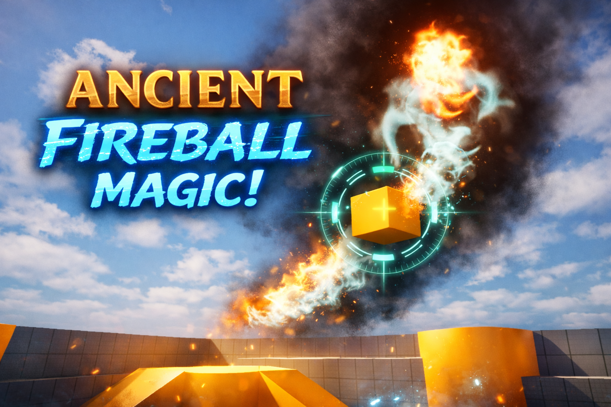
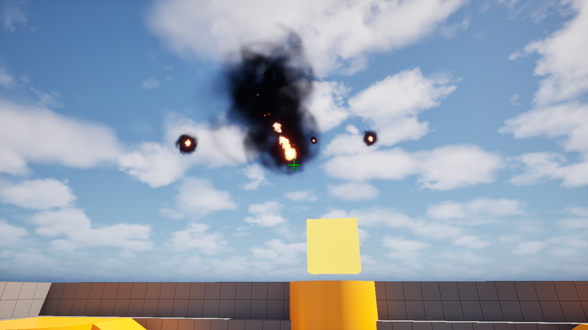
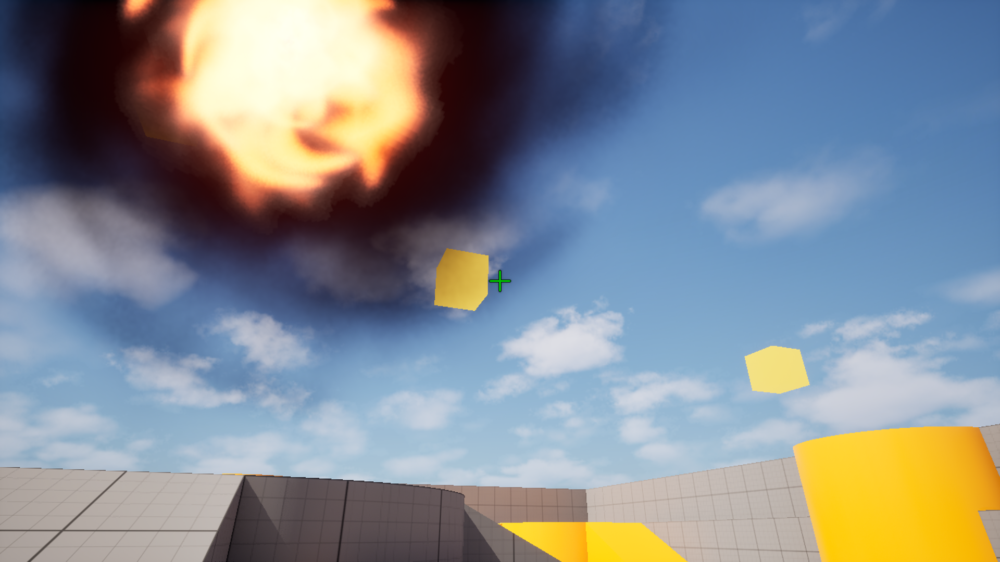
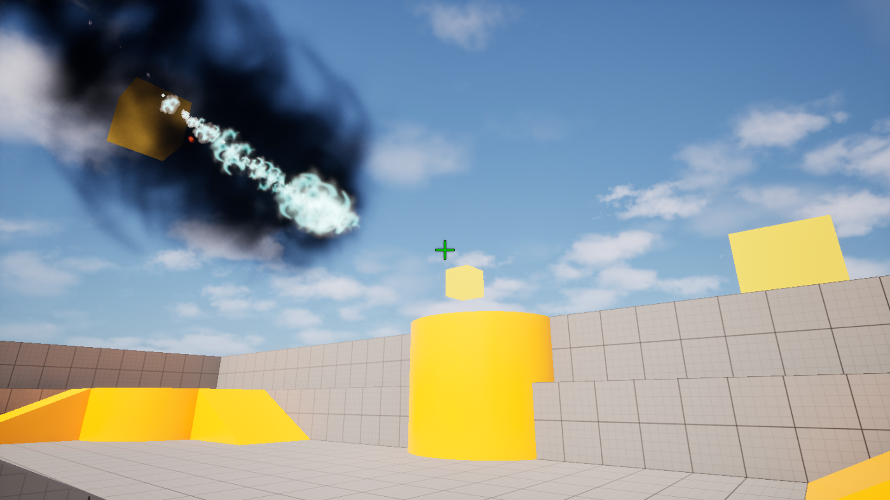
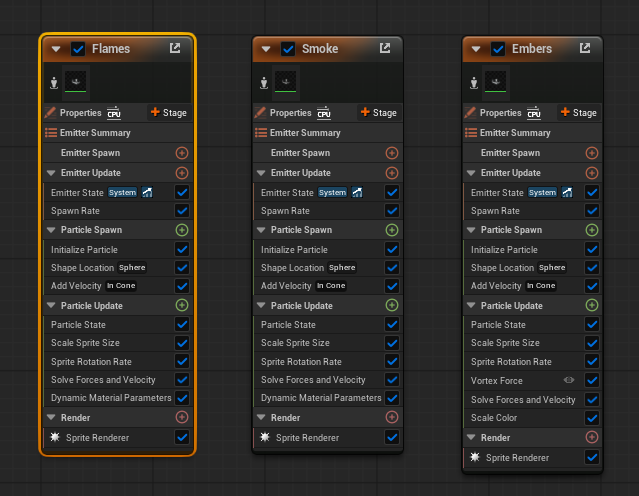
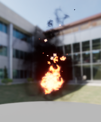

# Ancient Fireball Magic -- ChaseBall Prototype

A first-person magic combat prototype built in Unreal Engine using C++.

---

## Gameplay Showcase






---

## Playable Build

A Windows build is available here:

https://drive.google.com/drive/folders/1i14Iq47UF-OkovAkCswK4b2xlFaxTsSm?usp=sharing

Download the ZIP file, extract it, and run the executable.

---

## Overview

Ancient Fireball Magic is a gameplay prototype exploring:

- Charge-based projectile scaling
- Risk vs reward mechanics (size vs speed)
- Sweep-based homing detection
- Dynamic Niagara VFX scaling
- Spatial 3D audio attenuation

The goal was to create a satisfying magical combat mechanic that
reinforces fantasy fulfilment while maintaining systemic balance.

---

## Core Gameplay Features

### Charge-Based Scaling

- Hold mouse to charge.
- Projectile radius scales dynamically.
- Larger fireballs deal more impact but travel slower.
- Smaller fireballs are fast and agile.

### Directional Launch

- Launch direction follows camera forward vector.
- Accurate reticle-based aiming.

### Homing / Chase Mechanic

- Lock-on if aiming at enemy during release.
- Uses a detection sphere for sweep scanning.
- Detection radius scales with projectile size.
- Scan radius intentionally larger than visual projectile for aim
  forgiveness.

---

## Technical Architecture

### FPS Controller

Handles movement and camera aiming.

### Shooter Component

Responsible for: - Handling input - Managing charge values - Spawning
projectile actors

### AProjectileChaseBall (Core Logic)

- SphereComponent for collision
- Separate DetectionSphere for sweep scanning
- NiagaraComponent for VFX
- AudioComponent for 3D sound

#### Charge Scaling Logic

```cpp
const float NewRadius = FMath::Lerp(MinRadius, MaxRadius, ChargeAlpha);
MoveSpeed = FMath::Lerp(BaseSpeed, MinSpeed, ChargeAlpha);
```

#### Homing Logic

```cpp
const FVector Direction =
(TargetActor->GetActorLocation() - GetActorLocation()).GetSafeNormal();
```

---

## Niagara System

Fire, smoke, and ember effects created using Niagara.

- VFX scale via User parameters
- Color shifts on target lock
- Dynamic world scaling




Tutorial followed for base effect:
https://www.youtube.com/watch?v=OnxiEY3Khow

---

## Audio System

- Charging sound on spawn
- Release sound fades in on launch
- Spatialized 3D audio
- Attenuation for distance-based fading

---

## Controls

Input Action

---

Hold Left Mouse Charge fireball
Release Left Mouse Launch fireball
Aim at enemy while releasing Lock-on chase

---

## What I Learned

- Unreal Engine C++ gameplay architecture
- Component-based design patterns
- Sweep detection vs line trace targeting
- Niagara integration with C++
- Dynamic parameter-driven VFX
- Audio attenuation and spatialization
- Designing mechanics around player fantasy fulfilment

---

## Future Improvements

- Predictive homing
- Multiplayer replication
- Spell variations
- Impact damage system
- Enhanced UI feedback

---

## Author

Aartem Singh\
MSc Game Development\
Portfolio Project -- Unreal Engine C++

---

If you try the build, feedback is welcome.
